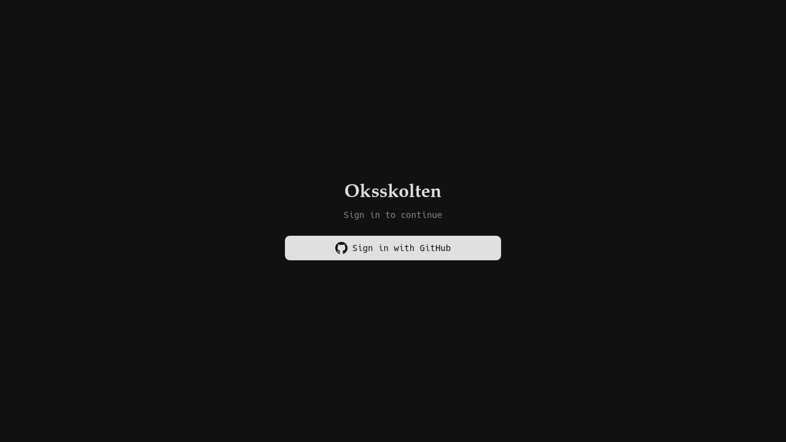
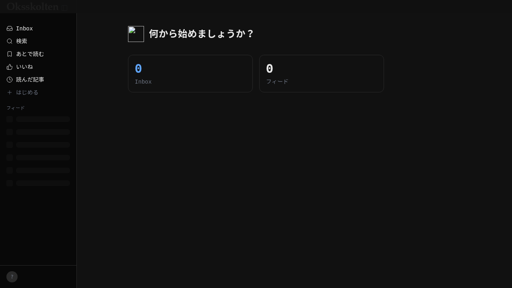
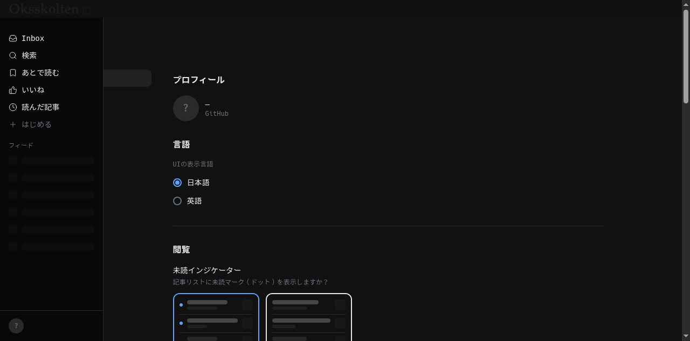

# Oksskolten Browser Client Demo

*2026-04-02T00:36:19Z*

Fork元の React SPA を同一 Cloudflare Worker から配信するブラウザクライアント。Workers Static Assets + ASSETS binding で SPA を配信し、Hono API と同一オリジンで動作する。

## Login Page

GitHub OAuth only. The SPA shows a login page with a "Sign in with GitHub" button. Dark mode is auto-detected from the browser preference.



## Home (authenticated)

After authentication, the home page shows a greeting and dashboard stats (inbox count, feed count). The sidebar has navigation: Inbox, Search, Bookmarks, Likes, History, and the feed list.



## Inbox

The Inbox page shows unread articles. A hint banner explains the inbox concept. The sidebar highlights the active nav item.


## Settings — General

Profile (read-only GitHub username), language selector (Japanese/English), and reading preferences (unread indicator, etc.).



## Settings — Appearance

Theme picker, color mode, font selection, and syntax highlighting theme. All preferences are persisted to the D1 settings table.


## API Health Check

Public endpoint intercepted before OAuthProvider — no auth required.

```bash
curl -s http://localhost:8787/api/health | python3 -m json.tool
```

```output
{
    "ok": true,
    "version": "0.1.0",
    "environment": "production"
}
```

## Architecture

- **Static Assets**: `[assets]` binding with `not_found_handling = "single-page-application"` and `html_handling = "none"`
- **Auth**: OAuthProvider `resolveExternalToken` for JWT + MCP OAuth coexistence. Browser OAuth at `/auth/github/*` (outside `/api/` prefix)
- **Public routes**: Intercepted before `oauth.fetch()` (OAuthProvider rejects all `/api/*` without Bearer token)
- **Stack**: React 19 + Vite + Tailwind 4 + SWR + Radix UI + Hono + D1
